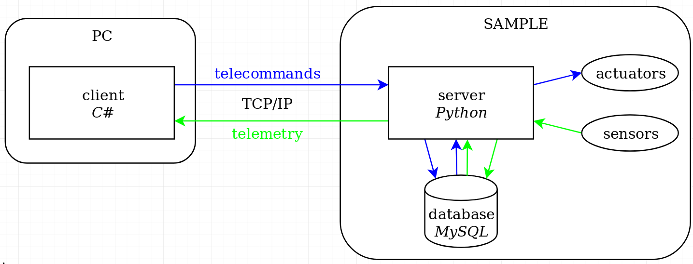

# sample-general

Semi-Autonomous Modular Plant and other Life-sustaining Experiment is a prototype of a small automatic greenhouse. It is developed by a team of university students from Students' Space Association from Warsaw University of Technology for the IGLUNA 2020 project of Swiss Space Center. See more at https://www.spacecenter.ch/igluna/projectteams/p05-sample/

Software part of this project is composed of the following modules:

