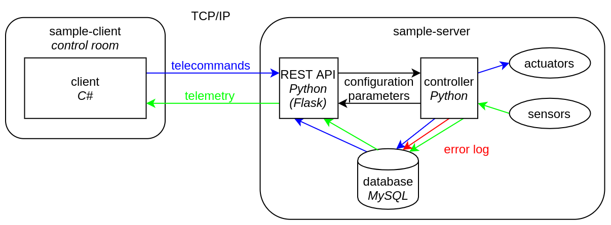

# sample-main

Semi-Autonomous Modular Plant and other Life-sustaining Experiment is a prototype of a small automatic greenhouse. It is developed by a team of university students from Students' Space Association from Warsaw University of Technology for the IGLUNA 2020 project of Swiss Space Center. See more at https://www.spacecenter.ch/igluna/projectteams/p05-sample/

Software part of this project is composed of the following modules:

To clone this repository with submodules, type:  
`git clone --recursive-submodules git@github.com:Dinuirar/sample-main.git`  
(you can replace `git@github.com:Dinuirar/sample-main.git` with `https://github.com/Dinuirar/sample-main.git` if you would like to clone this repository with HTTPS instead of SSH)

To update client and server submodules, use:  
`git submodule update --remote client`  
`git submodule update --remote server`  
